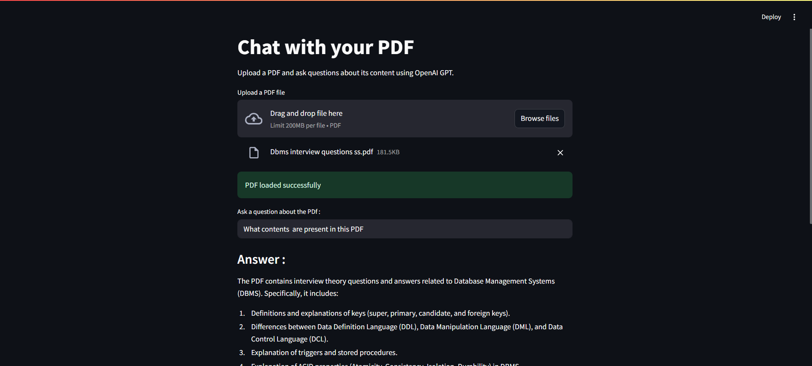
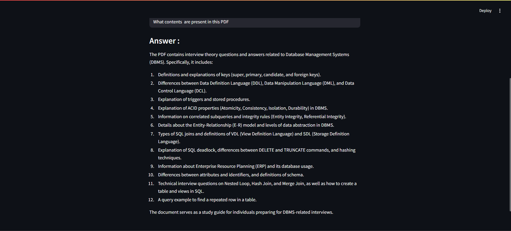

# PDF Q&A Chatbot

A simple Streamlit app that lets you upload a PDF file and ask questions about its content using OpenAI's GPT model (`gpt-4o-mini`).

## Features

- Upload a PDF and extract its text
- Ask any question related to the PDF
- Get accurate AI-generated answers in seconds
- Built using Streamlit + OpenAI API

## Tech Stack

- **Frontend & App**: Streamlit
- **Backend API**: OpenAI GPT-4o-mini
- **PDF Processing**: PyPDF2
- **Environment**: Python + dotenv

## 📷 Screenshots

  


## 📝 License

This project is licensed under the **MIT License**.
Feel free to use, modify, and distribute for personal and commercial purposes.

---

## 🙌 Contribution

Contributions, issues, and feature requests are welcome!
Feel free to fork this repo and submit a pull request.

---

## 💬 Contact

Created with ❤️ by Sushmitha Shettigar
Reach out via [LinkedIn](https://www.linkedin.com/in/sushmithashettigar/) or [GitHub](https://github.com/sushmithashettigar29)

```

```
